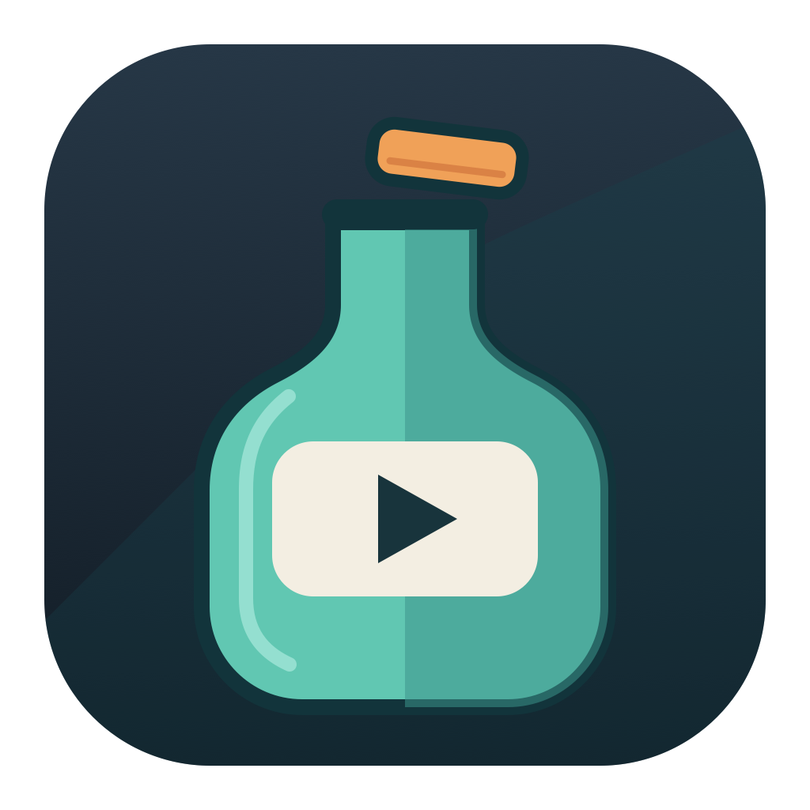

# OpenBottle

<p align="center">
  
</p>

i'm building a free, open-source macOS app for running Windows games. the point
is to install a game, see it in a library, and press Play without guessing which
Wine build, graphics backend, sync mode, resolution trick, or launch flag it
needs.

OpenBottle started from
[frankea/Whisky](https://github.com/frankea/Whisky), but it is now its own app.
it has its own name, icon, bundle IDs, URL scheme, command, update endpoints,
and data folder. installing it does not replace Whisky or change Whisky's
bottles. an old bottle is only copied when its owner chooses to import it.

## what the user opens

OpenBottle is a normal native Mac app. the SwiftUI library is the main
experience; the `openbottle` command is a secondary tool for scripts and
shortcuts. it is not a Whisky plugin and it does not require the user to start
from a terminal.

on a fresh Mac:

1. open OpenBottle and follow the setup for Rosetta and the verified Stable
   runtime;
2. OpenBottle creates one `Games` bottle and opens the game library;
3. click **Install a Windows game…** and choose an EXE, MSI, MSIX, or AppX
   installer;
4. finish the Windows installer normally;
5. OpenBottle finds the newly installed program and adds it to the library;
6. press the game card to play.

Steam games installed in the `Games` bottle appear in the same library.
dragged executables, Finder opens, Dock shortcuts, `openbottle://` links,
Steam App IDs, and CLI launches all enter the same safe launch path.
the Install button stays in the toolbar after the first game, so adding another
one uses the same flow.

## what Play does

before a game starts, OpenBottle:

1. identifies the game, launcher, executable, Mac hardware, and available
   runtime;
2. refuses known hard blockers such as Windows ARM executables and detected
   kernel anti-cheat drivers with a plain reason;
3. creates a verified local restore point for known and discovered save
   folders;
4. snapshots renderer DLLs and the settings it is about to change;
5. selects a tested hardware-specific profile when one fits, or a conservative
   DXVK profile when the machine is unknown;
6. runs the game with that runtime and profile;
7. restores temporary renderer changes after exit and keeps the new save plus
   its rollback point;
8. pins the runtime after a successful launch so an update cannot silently
   remove the last working engine.

Stable and Preview runtimes live in separate verified slots. each slot records
the archive hash, component hashes, versions, licenses, source links, and
capabilities. the runtime menu can switch the default without deleting the
previous one.

Steam Cloud is **off by default for each game**. choosing local-only starts
Steam offline and leaves OpenBottle's verified local restore points
authoritative. cloud access can be enabled per game from its library menu.

OpenBottle has no telemetry endpoint. a compatibility report is only created
when the user chooses **Export compatibility report…**. its JSON contains the
Mac class, component versions, selected profile, preflight result, save policy,
and last transaction timing/result. it excludes bottle and save paths, save
contents, account details, tokens, launch arguments, environment values, and
raw logs so it can be reviewed before sharing.

## current proof

the first measured game is
[Screw Drivers](https://store.steampowered.com/app/1279510/Screw_Drivers/) on a
64 GB M1 Max MacBook Pro with a 3456x2234 120 Hz display. the selected profile
renders at 1728x1117 through DXMT, reconstructs it at 2x with MetalFX, and uses a
120 FPS cap. a 21-minute play session completed four races and looked close to a
native-resolution run. a later comparison found the 120 FPS version noticeably
more responsive than 60 FPS.

that exact profile is restricted to the tested Mac, memory, display, and refresh
rate. other machines get the conservative DXVK setup. the measurements and
limits are in
[docs/benchmarks/screw-drivers-2026-09-05.md](docs/benchmarks/screw-drivers-2026-09-05.md).

## honest compatibility boundary

OpenBottle can make technically reachable games much easier, but it cannot make
every Windows game work:

| game or app | current route |
| --- | --- |
| Direct3D 8–11 without kernel dependencies | Wine with DXMT, DXVK, or WineD3D |
| Direct3D 12 | optional user-supplied Apple D3DMetal while open paths are evaluated |
| supported user-space anti-cheat | test per game and explain the risk |
| Windows kernel anti-cheat, kernel drivers, or incompatible DRM | detect and block with a reason |
| Windows ARM64 executable | ask for the x64 or x86 build |

Apple's D3DMetal is proprietary, so it is never bundled in the fully open
runtime. the redistributable path uses Wine, DXMT, DXVK, and MoltenVK. the app
code remains GPL-3.0 because it is derived from Whisky.

this first alpha is ad-hoc signed for testing and is not notarized. the wider
release matrix still needs more games, launchers, graphics APIs, controllers,
audio/video paths, and at least two Apple silicon generations before the project
can call itself a beta.

## build

open `OpenBottle.xcodeproj` in Xcode and build the `OpenBottle` scheme. with a
full Xcode toolchain:

```sh
swift test --package-path WhiskyKit
```

preview builds are on the
[GitHub releases page](https://github.com/EwoudVV/OpenBottle/releases). the
ordered work and release gates are in [docs/ROADMAP.md](docs/ROADMAP.md), and
the architecture is in [docs/PRODUCT-PLAN.md](docs/PRODUCT-PLAN.md).

## license

OpenBottle is available under [GPL-3.0](LICENSE). bundled runtime components
keep their own licenses; see [docs/DEPENDENCIES.md](docs/DEPENDENCIES.md).
