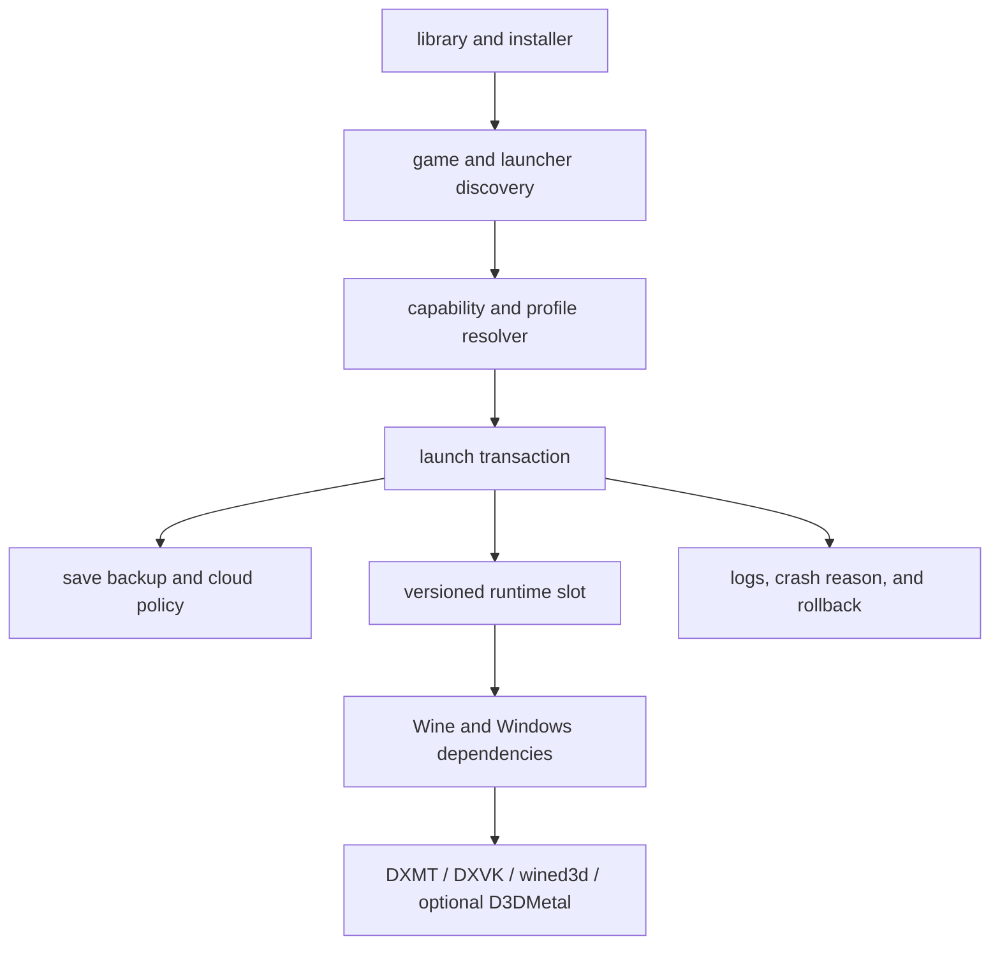

# product plan

OpenBottle should make a supported Windows game feel like a Mac app: install the
runtime once, add a game, and press Play. bottles, DLL overrides, Wine versions,
renderer choices, and save paths should stay out of the normal flow.

## the honest target

"every Windows game" is not a claim this project can make. some games require
Windows kernel drivers, anti-cheat modules, DRM, or graphics features that do not
exist on macOS. OpenBottle can still make the largest technically reachable set
of games easy and reliable.

| class | target |
| --- | --- |
| Direct3D 8–11 games without kernel dependencies | broad support through Wine, DXMT, DXVK, and wined3d |
| Direct3D 12 games | optional user-supplied D3DMetal first; keep an open backend under active evaluation |
| games with user-space anti-cheat enabled for Wine | test and support case by case |
| games requiring Windows kernel anti-cheat, drivers, or incompatible DRM | detect before launch and explain the blocker |

[DXVK](https://github.com/doitsujin/dxvk) covers Direct3D 8–11, while current
mainline builds require Vulkan 1.3 and a substantial feature set.
[vkd3d-proton](https://github.com/HansKristian-Work/vkd3d-proton) implements
Direct3D 12 over Vulkan and has even stronger driver requirements.
[MoltenVK](https://github.com/KhronosGroup/MoltenVK) maps a large Vulkan subset
to Metal, but it is not fully Vulkan-compliant. this means a modern Vulkan stack
cannot be treated as a drop-in macOS solution yet.

[DXMT](https://github.com/3Shain/dxmt) gives the open stack a direct Metal path
for Direct3D 10 and 11. Apple's
[Game Porting Toolkit](https://developer.apple.com/games/game-porting-toolkit/)
provides a strong optional evaluation path for newer games, but its proprietary
payload cannot be part of the fully open runtime.

Valve's own [Proton guidance](https://partner.steamgames.com/doc/steamhardware/proton)
says kernel-space anti-cheat is unsupported and that game developers must enable
supported anti-cheat middleware. OpenBottle cannot repair that from the outside.

Apple says general-purpose
[Rosetta support ends after macOS 27](https://developer.apple.com/news/?id=w5ngl9k2).
[FEX](https://github.com/FEX-Emu/FEX) is currently an Arm64 Linux emulator, not a
macOS replacement. the post-Rosetta engine therefore stays a research track until
there is a verified native path.

## the normal user flow

1. install and open OpenBottle;
2. let it install one verified stable runtime;
3. choose Steam, drag in an installer, or import an existing game;
4. see games in one library, without choosing a bottle first;
5. press Play and let OpenBottle choose a tested profile;
6. get a plain explanation when a game needs a component or cannot work;
7. restore the previous runtime or save from the same game page if something goes
   wrong.

advanced controls still exist, but they belong behind an Advanced button. the
default screen should show the game, Play, compatibility status, runtime status,
and the last safe restore point.

## the launch architecture

every Play button must use the same launch transaction, whether it came from the
library, a shortcut, a Steam App ID, a dragged executable, or another store. that
transaction should:

1. identify the exact game, executable, launcher, and runtime;
2. check known hard blockers before changing anything;
3. create a save and configuration restore point;
4. resolve the best compatible profile for this Mac;
5. apply renderer, synchronization, dependency, display, and launch settings;
6. run the game and record a small local result;
7. restore temporary files and retain the new save plus its rollback point;
8. show one useful failure reason if the launch did not work.

## what already exists

- a standalone native SwiftUI app with its own identity, storage, command, URL
  scheme, endpoints, icon, and copy-only Whisky bottle import;
- first-run Rosetta/runtime setup followed by an automatic `Games` bottle and
  a library-first home screen;
- standalone EXE/MSI/MSIX/AppX install, post-install program discovery, Steam
  game discovery, App ID routing, pinned programs, and macOS shortcuts;
- one shared launch transaction for the library, CLI, shortcuts, Steam, dragged
  files, Finder opens, and `openbottle://` links;
- verified save snapshots before and after launch, durable recovery, restore
  rollback, retention, broad path discovery, and a visible per-game local/cloud
  policy whose default is local-only;
- reversible renderer/configuration changes protected by a cross-process
  per-bottle launch lease;
- immutable Stable and Preview runtime slots with hashes, component versions,
  licenses, capabilities, rollback, and per-game known-good pins;
- hardware-aware GameDB variants with a conservative fallback for unknown Macs;
- preflight detection for missing runtime/Rosetta, Windows ARM64, known kernel
  anti-cheat drivers, declared unsupported games, user-space anti-cheat, and DRM;
- local, opt-in compatibility JSON containing the selected runtime/profile and
  scrubbed result without paths, accounts, saves, tokens, or raw logs;
- CI for the package, every Xcode scheme, resources, UI tests, localization,
  formatting, lint, identity, documentation, and secret scanning.

## what is missing

### prove more than one game and one Mac

Screw Drivers proves the transaction and profile ideas, but it is not a release
matrix. the next evidence has to cover the APIs, engines, stores, media, input,
failure cases, and two Apple silicon generations listed below.

### finish store adapters

Steam and standalone installers use the shared path. GOG import comes next,
followed by Epic, EA, Ubisoft, Rockstar, and Battle.net. their clients are
already detected, but detection is not the same as a complete install, library,
update, launch, and sign-out adapter.

### turn reports into reviewed profiles

the export exists and stays local. the project still needs a versioned review
process that can turn an inspected community report into a GameDB variant,
invalidate it after relevant game/runtime/macOS changes, and show the evidence
behind a compatibility claim.

### normal signed distribution

the first preview is ad-hoc signed. beta and 1.0 need a Developer ID, Apple
notarization, a reproducible release archive, a new OpenBottle Sparkle signing
key, and an update rollback drill. no upstream identity or signing material can
be reused.

### the open D3D12 and post-Rosetta paths

D3D12 still depends on an optional user-supplied Apple payload for the useful
path today. a fully open D3D12 route and a verified replacement for
general-purpose Rosetta after macOS 27 remain runtime research, measured against
the same matrix instead of promised ahead of evidence.

## release test matrix

a release cannot be judged by one game. the maintained matrix needs at least:

- one 32-bit Direct3D 9 game;
- one Direct3D 10 game;
- two Direct3D 11 engines with different workloads;
- one Direct3D 12-only game through every available D3D12 path;
- one 2D or software-rendered Windows application;
- one standalone installer and uninstaller;
- Steam plus two Chromium-based launchers;
- controller, keyboard and mouse, audio, video playback, and fullscreen checks;
- one supported user-space anti-cheat game;
- one known kernel anti-cheat blocker that must be rejected clearly;
- cold install, runtime update, rollback, save restore, and app upgrade tests.

each matrix entry records launch success, menu time, a short gameplay path,
renderer identity, frame pacing when available, input, audio, video, save result,
and clean shutdown. a regression in save safety, rollback, or the launch pipeline
blocks a release even when frame rate improves.

## definitions of done

### alpha

- a fresh Mac can install the app and stable runtime without Terminal;
- Steam and standalone installers reach the library;
- Play uses the shared transaction and a safe default profile;
- every launch has a local save restore point and reversible configuration;
- unsupported games get a clear reason instead of a silent failure.

### beta

- runtime slots and one-click rollback work;
- the full test matrix runs on at least two Apple silicon generations;
- community reports can update profiles without exposing private data;
- upgrades preserve bottles, saves, shortcuts, and known-good runtimes.

### 1.0

- signed and notarized builds install normally;
- stable updates are reproducible and have a rollback path;
- compatibility claims link to current evidence;
- the normal experience is install, choose a game, and press Play.
